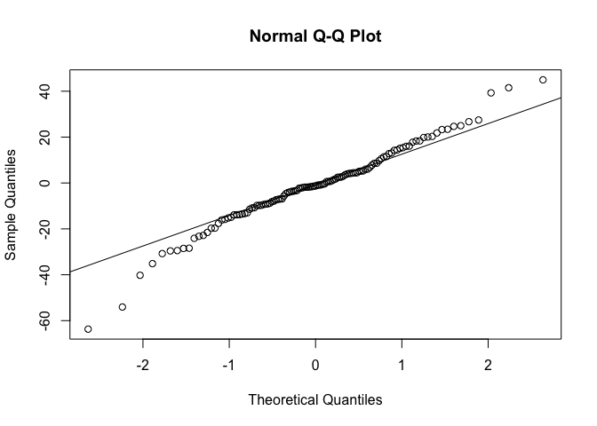

TEST
================
Junzhe Shao
12/12/2021

## data loading

``` r
cid_dt = read_csv('cdi.csv')
```

    ## Rows: 440 Columns: 17

    ## ── Column specification ────────────────────────────────────────────────────────
    ## Delimiter: ","
    ## chr  (2): cty, state
    ## dbl (15): id, area, pop, pop18, pop65, docs, beds, crimes, hsgrad, bagrad, p...

    ## 
    ## ℹ Use `spec()` to retrieve the full column specification for this data.
    ## ℹ Specify the column types or set `show_col_types = FALSE` to quiet this message.

``` r
cid_dt = cid_dt %>% mutate(region = factor(region),
                           crimes = crimes/pop * 1000,
                           docs = docs/pop *1000,
                           beds = beds/pop *1000)
cid_dt %>% select(-c(id,cty,state,crimes,region)) %>%
    pivot_longer(cols = everything(), names_to = "variables", values_to = "value") %>%
    ggplot(aes(factor(variables), value)) +geom_violin() + facet_wrap(~variables, scale="free")
```

<!-- -->

## outlier

``` r
# x = "area"
# cid_dt = as.data.table(cid_dt)
# for (x in colnames(cid_dt %>% select(-c(id,cty,state,crimes,region)))){
#   print(x)
#   cid_dt = cid_dt[!(cid_dt[[x]] %in% boxplot.stats(cid_dt[[x]])$out)]
# }
# cid_dt = as_tibble(cid_dt)
# cid_dt %>% select(-c(id,cty,state,crimes,region)) %>%
#   pivot_longer(cols = everything(), names_to = "variables", values_to = "value") %>%
#   ggplot(aes(factor(variables), value)) +geom_boxplot() + facet_wrap(~variables, scale="free")
```

## regression: stepwise, VIF …

``` r
set.seed(8130)
validation_dt = cid_dt %>% sample_frac(0.1)
tt_dt = cid_dt %>% filter(!(id %in% validation_dt$id))

tt_dt %>% select(-c(id,cty,state,crimes,region)) %>% as.data.frame %>% plot(pch=20 , cex=0.05 , col="#69b3a2")
```

<!-- -->

``` r
set.seed(8130)
train_dt = tt_dt %>% sample_frac(0.7)
test_dt = tt_dt %>% filter(!(id %in% train_dt$id))
t_select = train_dt %>% select(-c(id,cty,state,pop))
#t_select = train_dt %>% select(-c(id,cty,state,pop))
intercept_only <-  lm(crimes ~ 1, data = t_select)

#define model with all predictors
all <- lm(crimes ~ ., data = t_select)

#perform forward stepwise regression
forward <- step(intercept_only, direction='forward', scope=formula(all), trace=0)
forward$anova
```

    ##         Step Df   Deviance Resid. Df Resid. Dev      AIC
    ## 1            NA         NA       276  170064.93 1780.317
    ## 2  + poverty -1 42417.2012       275  127647.73 1702.844
    ## 3   + region -3 21193.9721       272  106453.75 1658.551
    ## 4     + docs -1 17060.2463       271   89393.51 1612.170
    ## 5 + totalinc -1  5297.0043       270   84096.50 1597.250
    ## 6     + beds -1  2493.3320       269   81603.17 1590.913
    ## 7   + bagrad -1  3683.4191       268   77919.75 1580.119
    ## 8 + pcincome -1   949.0602       267   76970.69 1578.724
    ## 9    + pop18 -1  3140.6825       266   73830.01 1569.184

``` r
forward$coefficients
```

    ##   (Intercept)       poverty       region2       region3       region4 
    ## -5.625844e+01  2.127342e+00  1.275529e+01  2.697177e+01  2.221295e+01 
    ##          docs      totalinc          beds        bagrad      pcincome 
    ## -4.189414e-01  2.154915e-04  3.451125e+00 -1.248342e-01  1.811945e-03 
    ##         pop18 
    ##  1.173439e+00

``` r
test_dt$pred_crime = predict(all, test_dt)
test_dt$residual = test_dt$pred_crime -test_dt$crimes
test_dt %>% plot(residual ~ crimes, data =.)
```

<!-- -->

``` r
mean(test_dt$residual^2)
```

    ## [1] 297.5467

``` r
car::vif(all)
```

    ##              GVIF Df GVIF^(1/(2*Df))
    ## area     1.459564  1        1.208124
    ## pop18    2.721523  1        1.649704
    ## pop65    2.052878  1        1.432787
    ## docs     3.342527  1        1.828258
    ## beds     3.748385  1        1.936075
    ## hsgrad   4.784924  1        2.187447
    ## bagrad   7.874531  1        2.806159
    ## poverty  3.882542  1        1.970417
    ## unemp    2.047445  1        1.430890
    ## pcincome 4.901364  1        2.213902
    ## totalinc 1.294216  1        1.137636
    ## region   2.917165  3        1.195346

## lasso

``` r
y = train_dt %>% select(crimes) %>% data.matrix()
x = train_dt %>% select(-c(crimes,id,cty,state)) %>% data.matrix()
set.seed(1)
cv_model <- cv.glmnet(x, y, alpha = 1)
plot(cv_model)
```

<!-- -->

``` r
lambda_se = cv_model$lambda.min
best_model <- glmnet(x, y, alpha = 1, lambda = lambda_se)
c =  coef(best_model)
print(c)
```

    ## 14 x 1 sparse Matrix of class "dgCMatrix"
    ##                        s0
    ## (Intercept) -8.287988e+01
    ## area        -1.787549e-03
    ## pop          7.226112e-05
    ## pop18        1.379204e+00
    ## pop65        2.602428e-01
    ## docs        -6.943673e-01
    ## beds         3.503800e+00
    ## hsgrad      -9.472505e-02
    ## bagrad      -8.687184e-02
    ## poverty      2.256426e+00
    ## unemp       -1.252174e-01
    ## pcincome     2.819901e-03
    ## totalinc    -3.250351e-03
    ## region       9.171573e+00

``` r
inds<-which(c!=0)
variables<-row.names(c)[inds][-1]
f = paste("bwt ~ ",paste(variables, collapse = " + "),sep = "")
cat(f)
```

    ## bwt ~ area + pop + pop18 + pop65 + docs + beds + hsgrad + bagrad + poverty + unemp + pcincome + totalinc + region

# result

``` r
new = test_dt %>% select(-c(crimes,id,cty,state,pred_crime,residual)) %>% data.matrix()
test_dt_lasso = test_dt
test_dt_lasso$pred_lasso = predict(best_model, s = lambda_se, newx = new)
test_dt_lasso$res_lasso = test_dt_lasso$pred_lasso -test_dt_lasso$crimes
test_dt_lasso %>% plot(residual ~ crimes, data =.)
abline(0,0)
```

<!-- -->

``` r
mean(test_dt_lasso$residual^2)
```

    ## [1] 297.5467

``` r
qqnorm(test_dt_lasso$res_lasso)
qqline(test_dt_lasso$res_lasso) 
```

<!-- -->

``` r
test_dt_lasso %>% plot(res_lasso ~ crimes, data =.)
mean(test_dt_lasso$res_lasso^2)
```

    ## [1] 288.6639

``` r
abline(0,0)
```

<!-- -->

``` r
qqnorm(test_dt_lasso$residual)
qqline(test_dt_lasso$residual) 
```

<!-- -->
