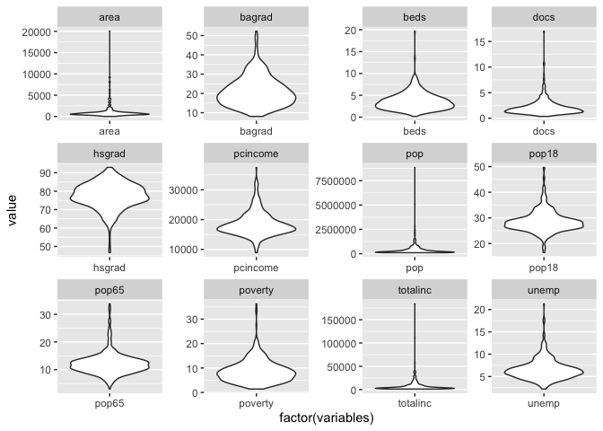
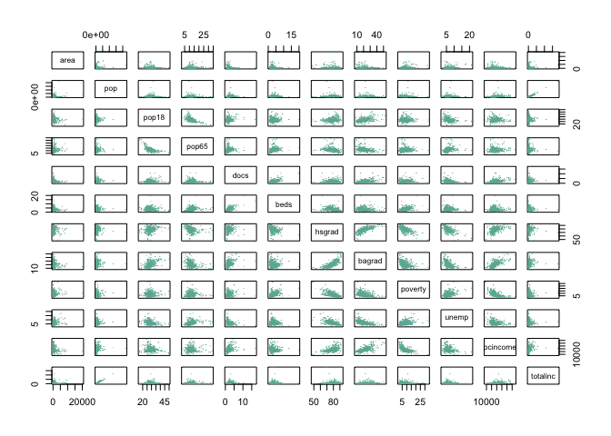

TEST
================
Junzhe Shao
12/12/2021

## data loading

``` r
cid_dt = read_csv('cdi.csv')
```

    ## Rows: 440 Columns: 17

    ## ── Column specification ────────────────────────────────────────────────────────
    ## Delimiter: ","
    ## chr  (2): cty, state
    ## dbl (15): id, area, pop, pop18, pop65, docs, beds, crimes, hsgrad, bagrad, p...

    ## 
    ## ℹ Use `spec()` to retrieve the full column specification for this data.
    ## ℹ Specify the column types or set `show_col_types = FALSE` to quiet this message.

``` r
cid_dt = cid_dt %>% mutate(region = factor(region),
                           crimes = crimes/pop * 1000)
cid_dt %>% select(-c(id,cty,state,crimes,region)) %>%
    pivot_longer(cols = everything(), names_to = "variables", values_to = "value") %>%
    ggplot(aes(factor(variables), value)) +geom_violin() + facet_wrap(~variables, scale="free")
```

<!-- -->

## outlier

## regression: stepwise, VIF …

``` r
set.seed(8130)
validation_dt = cid_dt %>% sample_frac(0.1)
tt_dt = cid_dt %>% filter(!(id %in% validation_dt$id))

tt_dt %>% select(-c(id,cty,state,crimes,region)) %>% as.data.frame %>% plot(pch=20 , cex=1.5 , col="#69b3a2")
```

<!-- -->

``` r
set.seed(8130)
train_dt = tt_dt %>% sample_frac(0.7)
test_dt = tt_dt %>% filter(!(id %in% train_dt$id))

t_select = train_dt %>% select(-c(id,cty,state,pop,totalinc,docs))
intercept_only <-  lm(crimes ~ 1, data = t_select)

#define model with all predictors
all <- lm(crimes ~ ., data = t_select)

#perform forward stepwise regression
forward <- step(intercept_only, direction='forward', scope=formula(all), trace=0)
forward$anova
```

    ##         Step Df   Deviance Resid. Df Resid. Dev      AIC
    ## 1            NA         NA       276  170064.93 1780.317
    ## 2  + poverty -1 42417.2012       275  127647.73 1702.844
    ## 3   + region -3 21193.9721       272  106453.75 1658.551
    ## 4     + beds -1 16448.4747       271   90005.28 1614.059
    ## 5   + bagrad -1  7729.2905       270   82275.99 1591.187
    ## 6 + pcincome -1  1598.8260       269   80677.16 1587.752
    ## 7    + pop18 -1  2382.6550       268   78294.51 1581.448
    ## 8    + pop65 -1  1358.0712       267   76936.44 1578.601
    ## 9   + hsgrad -1   565.6121       266   76370.82 1578.557

``` r
forward$coefficients
```

    ##   (Intercept)       poverty       region2       region3       region4 
    ## -1.082250e+02  2.998678e+00  1.531464e+01  2.780445e+01  1.929891e+01 
    ##          beds        bagrad      pcincome         pop18         pop65 
    ##  2.093135e-03 -3.146961e-01  2.063635e-03  1.489331e+00  7.821320e-01 
    ##        hsgrad 
    ##  4.537523e-01

``` r
test_dt$pred_crime = predict(all, test_dt)
test_dt$residual = test_dt$pred_crime -test_dt$crimes
test_dt %>% plot(residual ~ crimes, data =.)
```

<!-- -->

``` r
mean(test_dt$residual^2)
```

    ## [1] 310.5697

``` r
car::vif(all)
```

    ##              GVIF Df GVIF^(1/(2*Df))
    ## area     1.448687  1        1.203614
    ## pop18    2.648302  1        1.627360
    ## pop65    1.754283  1        1.324493
    ## beds     1.289336  1        1.135489
    ## hsgrad   4.749307  1        2.179290
    ## bagrad   7.326535  1        2.706757
    ## poverty  3.089264  1        1.757630
    ## unemp    1.888160  1        1.374103
    ## pcincome 4.646000  1        2.155458
    ## region   2.560427  3        1.169640

## lasso

``` r
y = train_dt %>% select(crimes) %>% data.matrix()
x = train_dt %>% select(-c(crimes,id,cty,state)) %>% data.matrix()
set.seed(1)
cv_model <- cv.glmnet(x, y, alpha = 1)
plot(cv_model)
```

<!-- -->

``` r
lambda_se = cv_model$lambda.1se
best_model <- glmnet(x, y, alpha = 1, lambda = lambda_se)
c =  coef(best_model)
print(c)
```

    ## 14 x 1 sparse Matrix of class "dgCMatrix"
    ##                        s0
    ## (Intercept) -3.616861e+01
    ## area        -5.628908e-04
    ## pop          .           
    ## pop18        1.001365e+00
    ## pop65        1.845595e-01
    ## docs         .           
    ## beds         4.892768e-03
    ## hsgrad       .           
    ## bagrad       .           
    ## poverty      2.353167e+00
    ## unemp       -3.952911e-01
    ## pcincome     1.273451e-03
    ## totalinc    -5.204491e-04
    ## region       7.297640e+00

``` r
inds<-which(c!=0)
variables<-row.names(c)[inds][-1]
f = paste("bwt ~ ",paste(variables, collapse = " + "),sep = "")
cat(f)
```

    ## bwt ~ area + pop18 + pop65 + beds + poverty + unemp + pcincome + totalinc + region

# result

``` r
new = test_dt %>% select(-c(crimes,id,cty,state,pred_crime,residual)) %>% data.matrix()
test_dt_lasso = test_dt
test_dt_lasso$pred_lasso = predict(best_model, s = lambda_se, newx = new)
test_dt_lasso$res_lasso = test_dt_lasso$pred_lasso -test_dt_lasso$crimes
test_dt_lasso %>% plot(residual ~ crimes, data =.)
```

<!-- -->

``` r
mean(test_dt_lasso$residual^2)
```

    ## [1] 310.5697

``` r
test_dt_lasso %>% plot(res_lasso ~ crimes, data =.)
```

<!-- -->

``` r
mean(test_dt_lasso$res_lasso^2)
```

    ## [1] 318.0801
